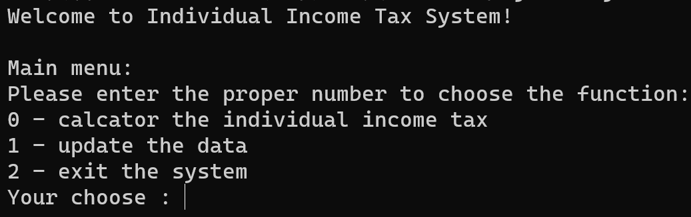

<center><b><font size = "7">编译原理预备实验


<center><b><font size = "5">计算个人所得税 PersonalTax

<center><b><font size = "5">设计文档


---


### 1 开发环境与开发工具

操作系统：Windows 11

java：java 17.0.2

回归测试语言：g++ (Built by MinGW-W64 project) 8.1.0


### 2 需求分析

1. 设计一个基于命令行界面的计算个人所得税（工资、薪金所得）应用程序，根据用户输入的当月工资薪 金总额计算应缴纳的个人所得税额。 
2. 为适应未来个人所得税法的可能变化（历史上曾有不同城市执行不同标准的情况，也曾发生过立法修改 个人所得税起征基数），该程序应支持对个人所得税起征点进行调整的功能，并且个人所得税各级税率 也允许修改。
3. 请使用简单的命令行菜单方式让用户选择所需的功能。


<div STYLE="page-break-after: always;"></div>

### 3 系统设计

#### 3.1 模块设计

##### 3.1.1 Presentation

功能：提供给用户的UI界面。


成员函数：

- chooseType()：用于用户的功能选择（计算或者更新）。
- chooseUpdata()：用于选择更新的种类（起征点或者税率）。
- readSalary()：用于用户输入工资。
- readBase()：用于用户输入更新后的起征点。
- readLevel()：用于用户输入需要更新税率的等级。
- readRate()：用于用户输入更新的税率。

##### 3.1.2 Calcator

功能：用于根据用户的工资计算个人所得税。


成员变量及函数：

- jbaseline：起征点类的实例化。

- jtax：税表类的实例化。
- subtraction()：用于计算应纳税额。
  - 输入参数：双精度浮点数，用户工资。
  - 返回参数：双精度浮点数，应纳税额。
- calc()：用于计算个人所得税。
  - 输入参数：双精度浮点数，应纳税额。
  - 返回参数：双精度浮点数，个人所得税。

##### 3.1.3 StartPoint

功能：存储起征点。


成员变量及函数：

- baseline：双精度浮点数，起征点。
- set()：用于设置起征点。
  - 输入参数：双精度浮点数，新起征点。
  - 返回参数：布尔类型，表示是否更新成功。
- get()：用于获取起征点。

##### 3.1.4 Tax

功能：存储税表。


成员变量及函数：

- rows：税表行的实例化数组。
- numRow：税表中等级的数量。
- getNum()：用于获取税表中的等级数。
- getLevelStart()：用于获取某一个等级的应纳税所得额区间的起点。
  - 输入参数：整形，应纳税所得额等级。
  - 返回参数：双精度浮点数，应纳税所得额区间起点。
- getLevelEnd()：用于获取某一个等级的应纳税所得额区间的终点。
  - 输入参数：整形，应纳税所得额等级。
  - 返回参数：双精度浮点数，应纳税所得额区间终点。
- getLevelRate()：用于获取某一个等级的税率。
  - 输入参数：整形，应纳税所得额等级。
  - 返回参数：双精度浮点数，该等级的税率。
- updata()：用于更新某一个等级的税率。
  - 输入参数：整形，应纳税所得额等级；双精度浮点数，该等级的税率。
  - 返回参数：整形，是否更新成功。

##### 3.1.5 Row

功能：存储税表的一个等级的信息。


成员变量及函数：

- start：整形，应纳税所得额的起点。
- end：整形，应纳税所得额的终点。
- rate：双精度浮点型，税率。
- getStart()：用于获取应纳税所得额的起点。
- getEnd()：用于获取应纳税所得额的终点。
- getRate()：用于获取税率。
- setStart()：用于设置应纳税所得额的起点。
- setEnd()：用于设置应纳税所得额的终点。
- setRate()：用于设置。

#### 3.2 UML


#### 3.3 数据流

##### 3.3.1 查询个人所得税


##### 3.3.2 更新起征点


##### 3.3.2 更新税率


<div STYLE="page-break-after: always;"></div>

### 4 功能设计

#### 4.1 计算模块

​		表达层将用户工资数据传输给计算模块。

1. 计算模块将工资传递给起征点模块；

2. 起征点模块根据工资和起征点，通过公式
   $$
   应纳税额=\max\{0,工资-起征点\}
   $$
   得到应纳税额，并将该数据返回给计算模块。

3. 计算模块将应纳税额传递给税表模块，伪代码如下：

   ```
   initial <- 应纳税额
   handIn <- 0
   for level <- 1 to numOfLevel do
   	begin <- 该等级的起点
   	end <- 该等级的终点
   	rate <- 该等级的税率
       if initial > end then
       	handIn <- handIn + (end - begin) * rate
       elseif (begin <= initial and initial <= end) then
       	handIn <- handIn + (initial - begin) * rate
   end
   return initial
   ```

   其中，该等级的起点、终点和税率信息，由计算模块将等级信息传递给行类，行类将信息返回给计算模块。

​		最终，计算模块将个人所得税返回给表达层。

#### 4.2 更新模块

##### 4.2.1 更新起征点

1. 表达层将新起征点传递给起征点模块；
2. 起征点更新起征点，并将更新结果（是否成功）返回给表达层。

##### 4.2.2 更新税率

1. 表达层将需要更新的等级和新的税率传递给税表模块；
2. 税表模块根据等级信息，将新的税率传递给该等级的税表行的实例化；
3. 税表行更新税率，并将更新结果（是否成功，如果失败则返回错误原因）返回给表达层。

#### 4.3 交互设计

##### 4.3.1 主菜单设计

​		提供给用户查询和修改的选项，以及退出程序的设计。



##### 4.3.2 查询界面设计

​		提供给用户输入工资的界面，计算并显示用户的个人所得税。


##### 4.3.3 修改界面设计

​		提供两种操作方式给用户：修改起征点和修改税率。

​		其中，更新起征点的界面表现为，提供一个输入界面给用户，由用户输入新的起征点。


​		而更新税表前， 由于税表比较复杂，因此先打印税表给用户进行参考。


​		接着再提供输入界面给用户，先让用户输入需要修改的税表等级，再输入修改后的税率。这样使得用户可以根据税表信息修改税率。


##### 4.3.4 非法输入检测

​		用户可能会输入不合法的内容，因此需要对输入内容进行检测。

​		其中，主菜单必须选择0、1或者2，不合法输入会被要求重新输入。


​		用户输入的工资必须是一个合法的非负浮点数，如不合法会要求重新输入和显示错误信息。


​		起征点的输入处理同工资的输入处理。


​		更新税表的等级要求在合理区间内，否则会显示错误信息。


​		税率的输入要求为一个$[0,1]$区间内的浮点数。


**以上任何不合法输入都不会导致程序出现错误。**


<div STYLE="page-break-after: always;"></div>

### 5 测试运行

​		回归测试要求修改了旧代码后，重新进行测试以确认修改没有引入新的错误或导致其他代码产生错误。自动回归测试将大幅降低系统测试、维护升级等阶段的成本。脚本`check.exe`实现了自动回归测试。

​		以下是测试点数据的用途分布。

| 测试点编号 | 测试点主要测试用途             | 诱发错误               | 最新测试结果 |
| ---------- | ------------------------------ | ---------------------- | ------------ |
| 0          | 测试计算正确性                 | 无                     | 正确         |
| 1          | 测试更新起征点后的计算正确性   | 没有显示更新成功       | 正确         |
| 2          | 测试大量更新操作后的计算正确性 | 没有显示更新成功       | 正确         |
| 3          | 随机测试                       | 无                     | 正确         |
| 4          | 随机测试                       | 无                     | 正确         |
| 5          | 随机测试                       | 无                     | 正确         |
| 6          | 随机测试                       | 无                     | 正确         |
| 7          | 随机测试                       | 无                     | 正确         |
| 8          | 随机测试                       | 无                     | 正确         |
| 9          | 大量不合法输入，测试健壮性     | 没有处理输入为负的情况 | 正确         |

#### 5.1 正确性和健壮性

​		脚本采用重定向输入输出以及`fc`指令实现。

​		截取一部分测试结果，测试过程中未出现程序崩溃的状况。


#### 5.2 可读性

​		所有源代码严格遵循 Sun 公司（现为 Oracle 公司）关于 Java 程序设计语言的编码规范（Code Conventions for the Java Programming Language，Revised  April 1999），**并对所有对象和成员变量及函数写好注释**。

#### 5.3 可扩展性

​		由于实验**仅要求对税率进行更新**，因此没有实现税表插入行，或者是更改税表的起点和终点的操作。

​		事实上，由于税表的实现中，税表的每一行为一个Row类的实体化，因此一个税表为一个Row类的数组。因此，税表中**插入行可以很容易地可以通过数组中插入一个Row类实现**。同时，Row类支持对起点、终点的修改，**该部分已实现**。因此，尽管没有提供给用户该选项，但使用者可以**很容易地通过调用该接口实现该功能**。

#### 5.4 添加数据说明

1. 添加的测试数据需满足：输入数据`in$x$.txt`，答案数据`ans$x$.txt`，其中`x`为序号，需要保证与现有数据的序号连续。
2. 添加完成后，需要修改`cnt.txt`中的数字，该数字表示数据总组数。


### 6 附件说明

目录如下：

```
D:.
│  build.bat
│  check.cpp
│  check.exe
│  README.txt
│  tax.bat
│  设计文档.pdf
│
├─bin
│  │  check.exe
│  └─tax
│          Calcator.class
│          Presentation.class
│          Row.class
│          StartPoint.class
│          Tax.class
│
├─doc
│  ├─legal
│  ├─resources
│  └─script-dir
│      └─images
│
├─src
│      Calcator.java
│      Presentation.java
│      Row.java
│      StartPoint.java
│      Tax.java
│
└─testData
    │  cnt.txt
    │  generator.cpp
    │  generator.exe
    ├─ans
    ├─in
    └─out
```

1. 提供了运行代码的脚本：`work.bat`，运行后可以直接看到用户需要的UI界面。**该脚本需要放置在源代码的同一目录下，在Windows环境下使用。**
2. 提供了测试数据，是在源代码目录下以文件夹`data`的形式存在，`\data\inx.txt`表示测试数据的输入，`\data\ansx.txt`表示该测试数据的正确结果。
3. 提供了回归测试的自动化测试脚本`check.exe`，该脚本采用c++编写，**在Windows环境下使用**。
4. 提供了`doc`文件，内部包含生成的`javadoc`。

